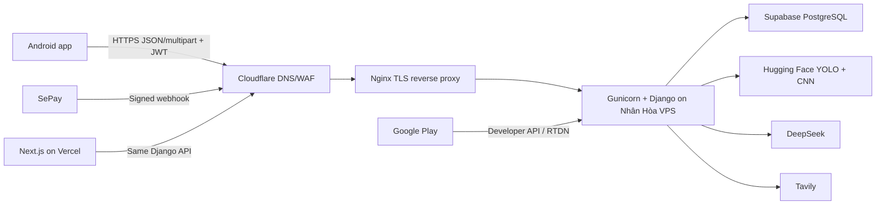

# Cloud, security và deployment cho Android

## 1. Sơ đồ production

Nguồn sự thật:

- Android/Web: presentation + local cache.
- Django: auth, ownership, quota, plan, AI orchestration, payment, persistence.
- Supabase: PostgreSQL storage; client không kết nối trực tiếp.
- Hugging Face: model inference chỉ Django gọi.
- DeepSeek/Tavily: secret chỉ server có.
- SePay/Google Play: server xác minh rồi mới cấp entitlement.

## 2. Environment trên VPS

Biến server cần được quản lý bằng systemd `EnvironmentFile` có permission `600` hoặc secret manager; không commit:

- `SECRET_KEY`
- `SUPABASE_DB_URL`
- `CNN_API_URL`, `CNN_API_TOKEN`
- `DEEPSEEK_API_KEY`, `DEEPSEEK_MODEL`
- `TAVILY_API_KEY`
- `SEPAY_WEBHOOK_SECRET` và cấu hình ngân hàng/merchant cần thiết
- Email provider credentials
- Google Play service account path/credential server-side nếu triển khai billing Play
- `ALLOWED_HOSTS=api.agromind.farm`
- `CORS_ALLOWED_ORIGINS=https://www.agromind.farm,https://agromindai.vercel.app`
- `CSRF_TRUSTED_ORIGINS=https://api.agromind.farm,https://www.agromind.farm`
- `FRONTEND_ORIGIN=https://www.agromind.farm`

Native Android dùng Bearer JWT nên CORS không phải cơ chế bảo vệ app. Không thêm wildcard CORS chỉ để sửa Android; Android native không chịu chính sách CORS của browser.

Sau khi đổi env:

1. `sudo systemctl daemon-reload` nếu unit/env path đổi.
2. `sudo systemctl restart agromind-backend`.
3. `sudo systemctl status agromind-backend`.
4. Kiểm tra journal không in secret.
5. Test `/api/health/`, auth, CNN, research, payment sandbox.

## 3. Cloudflare

- DNS `api.agromind.farm` trỏ đúng VPS và proxy orange-cloud nếu TLS/WAF đã cấu hình.
- SSL mode `Full (strict)`; origin certificate/Let's Encrypt hợp lệ.
- WAF/rate limit theo route:
  - auth register/login/reset: giới hạn chặt, có thể Turnstile.
  - diagnoses/chat/research: JWT + Django quota + rate limit theo user/IP.
  - webhook SePay/Google RTDN: xác minh chữ ký/token; không browser challenge.
  - health: read-only, rate limit vừa.
- Không Managed Challenge toàn bộ `/api/*` vì app sẽ nhận HTML challenge thay JSON.
- Nếu dùng Turnstile native, dùng WebView challenge page theo Cloudflare, token one-time gửi Django Siteverify; secret chỉ server.
- Bot protection không thay thế auth, quota, idempotency, webhook signature hoặc payment verification.

## 4. Payment distribution decision

### Google Play

Gói Grow/Bloom/Elite là tính năng số. Nếu app phát hành trên Google Play, mặc định phải dùng Google Play Billing. Backend phải verify purchase token và xử lý lifecycle/RTDN. Không đặt QR SePay, số tài khoản hoặc link thanh toán ngoài trong flavor Play nếu chưa được Google chấp thuận chương trình thay thế phù hợp.

### Direct APK

Flavor direct có thể dùng order/QR SePay hiện tại. Ký APK bằng key riêng, publish checksum và update channel an toàn. Không dùng cùng một artifact nhị phân cho hai policy khác nhau.

## 5. CI secrets

GitHub/CI environment:

- `ANDROID_KEYSTORE_BASE64`
- `ANDROID_KEY_ALIAS`
- `ANDROID_KEYSTORE_PASSWORD`
- `ANDROID_KEY_PASSWORD`
- staging base URL nếu private
- Play service-account chỉ cho upload pipeline, không đóng gói vào app

Không dùng secret trong PR từ fork. Release job cần protected branch, manual approval và least privilege.

## 7. Logging, privacy, retention

- Log request ID, route, status, duration; không log body auth/payment/AI image.
- Crash reporting phải scrub JWT, email, image URI/base64, bank details, symptoms nếu coi là dữ liệu nhạy cảm.
- Analytics opt-in theo cài đặt; không gửi ảnh lá cho analytics.
- Ảnh local cache có TTL và xóa khi logout/account deletion.
- Privacy policy phải nói rõ ảnh được gửi server/HF để phân tích, vị trí dùng cho thời tiết, dữ liệu thanh toán do provider xử lý.
- Hỗ trợ delete account xóa local data ngay và backend data theo contract.

## 8. Release gates

- Debug artifact không bao giờ trỏ production mặc định nếu có logger/HTTP override.
- Release cấm cleartext, debuggable false, backup rules được kiểm tra.
- APK/AAB scan không chứa chuỗi `SUPABASE_DB_URL`, `DEEPSEEK_API_KEY`, `TAVILY_API_KEY`, `SEPAY_WEBHOOK_SECRET`, private key hoặc token thật.
- Dependency vulnerability scan và license report.
- Test mạng chậm/mất mạng, TLS lỗi, Cloudflare HTML 403, token expired, provider timeout.
- Internal testing ít nhất một vòng với tài khoản Seed/Grow/Bloom/Elite và controlled payment sandbox/thật nhỏ.

## 9. Tài liệu kỹ thuật chính thức để Claude Code đối chiếu

- Android architecture: https://developer.android.com/topic/architecture
- Architecture recommendations: https://developer.android.com/topic/architecture/recommendations
- Compose UDF: https://developer.android.com/develop/ui/compose/architecture
- CameraX: https://developer.android.com/media/camera/camerax/take-photo
- Photo Picker: https://developer.android.com/training/data-storage/shared/photo-picker
- WorkManager: https://developer.android.com/develop/background-work/background-tasks/persistent
- Credential Manager + Google: https://developer.android.com/identity/sign-in/credential-manager-siwg-implementation
- Android Keystore: https://developer.android.com/privacy-and-security/keystore
- Network Security Config: https://developer.android.com/privacy-and-security/security-config
- Cloudflare Turnstile mobile: https://developers.cloudflare.com/turnstile/get-started/mobile-implementation/
- Play Billing: https://developer.android.com/google/play/billing/integrate
- Play Billing backend: https://developer.android.com/google/play/billing/backend
- Google Play payments policy: https://support.google.com/googleplay/android-developer/answer/9858738
