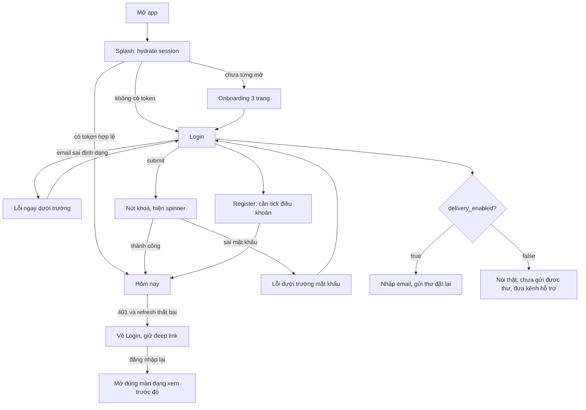
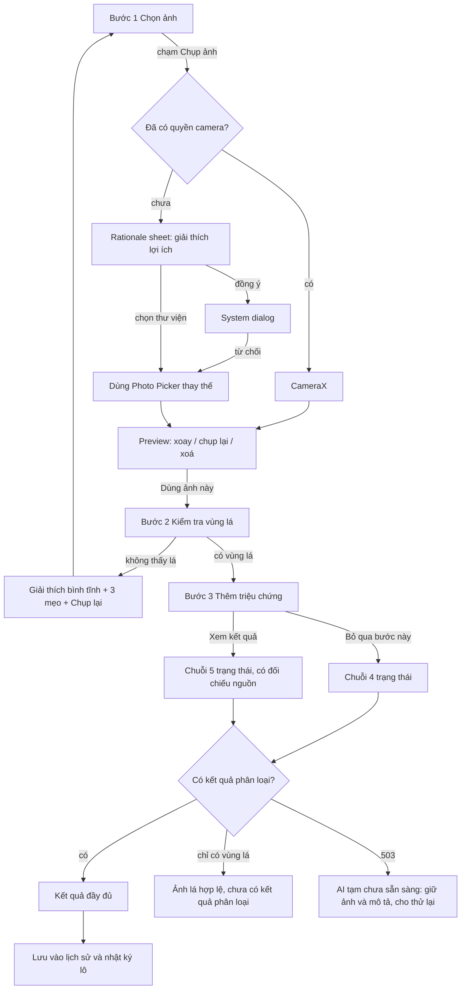
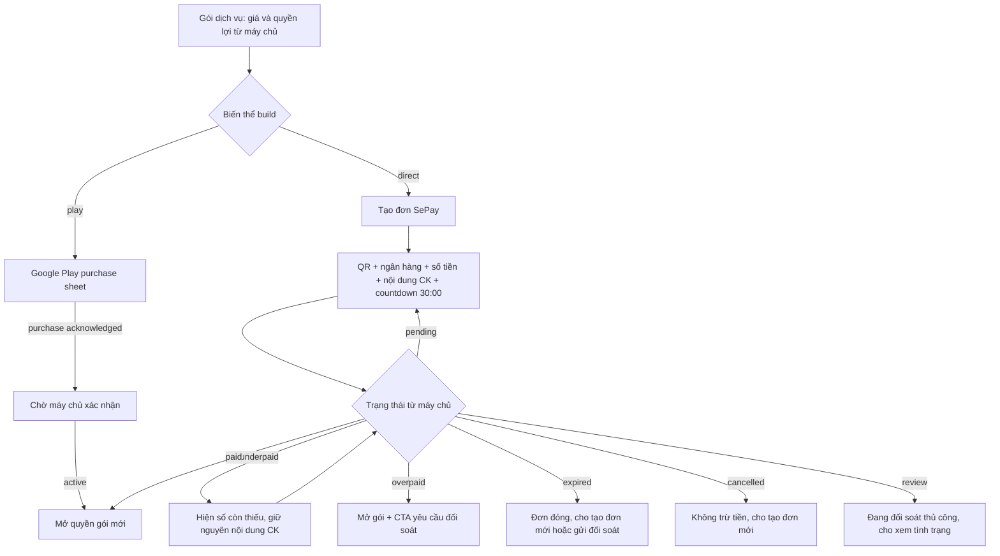
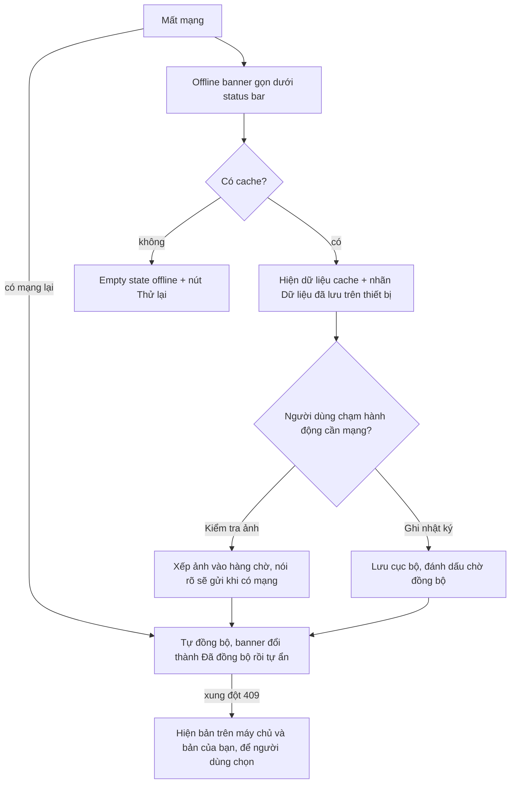

# USER FLOWS

## 1. Auth và session

## 2. Diagnosis 4 bước

Mỗi bước ghi lại vào draft cục bộ, nên app bị đóng giữa luồng thì mở lại đúng bước đó với ảnh và mô tả còn nguyên.

## 3. Payment

Không có màn chúc mừng nào trước khi máy chủ trả `paid`/`active`. Biến thể `play` không có bất kỳ liên kết nào dẫn sang SePay bên trong app.

## 4. Offline và retry

